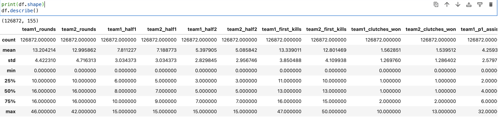

<!-- Improved compatibility of back to top link: See: https://github.com/othneildrew/Best-README-Template/pull/73 -->

<!--
*** Thanks for checking out the Best-README-Template. If you have a suggestion
*** that would make this better, please fork the repo and create a pull request
*** or simply open an issue with the tag "enhancement".
*** Don't forget to give the project a star!
*** Thanks again! Now go create something AMAZING! :D
-->

<!-- PROJECT SHIELDS -->
<!--
*** I'm using markdown "reference style" links for readability.
*** Reference links are enclosed in brackets [ ] instead of parentheses ( ).
*** See the bottom of this document for the declaration of the reference variables
*** for contributors-url, forks-url, etc. This is an optional, concise syntax you may use.
*** https://www.markdownguide.org/basic-syntax/#reference-style-links
-->
[![Contributors][contributors-shield]][contributors-url]
[![Forks][forks-shield]][forks-url]
[![Stargazers][stars-shield]][stars-url]
[![Issues][issues-shield]][issues-url]
[![MIT License][license-shield]][license-url]
[![LinkedIn][linkedin-shield]][linkedin-url]

<!-- PROJECT LOGO -->
 

  

<h3 align="center">CS:GO Pro Matches Comprehensive Dataset</h3>

  

    The largest public dataset of Professional CS:GO games, spanning from 2012 to 2023.
     
     
    <a href="https://github.com/tedtay/CS-GO-Pro-Matches-Comprehensive-Dataset/issues">Report Bug</a>
    ·
    <a href="https://github.com/tedtay/CS-GO-Pro-Matches-Comprehensive-Dataset/issues">Request Feature</a>
  

<!-- TABLE OF CONTENTS -->

  
Table of Contents

  <ol>
    <li>
      <a href="#about-the-project">About The Project</a>
      <ul>
        <li><a href="#built-with">Built With</a></li>
      </ul>
    </li>
    <li><a href="#overview-of-the-data ">Overview Of The Data </a></li>
    <li><a href="#collecting-the-data ">Collecting The Data </a></li>
    <li><a href="#contributing">Contributing</a></li>
    <li><a href="#license">License</a></li>
    <li><a href="#contact">Contact</a></li>
  </ol>

<!-- ABOUT THE PROJECT -->
## About The Project

  

 This project aims to help further our understanding of FPS eSports by providing a comprehensive dataset containing (almost) all CS:GO Pro games. I encourage all interested Data Analyst/Scientists, ML Engineers, Data Engineers, hobbyists and so on to play around with the dataset, create models, analyse niche areas and share your findings back with the eSports and data community.

(<a href="#readme-top">back to top</a>)

### Built With

* 
* 
* 
* 
* 

(<a href="#readme-top">back to top</a>)

<!-- CONTRIBUTING -->
## Overview Of The Data 

The dataset has a shape of **(126872, 155)** meaning 126872 games have been recorded and 155 different data points (features) have been logged for each game. This is a reasonably large ammount of data so the .csv file is approximatly 87Mb.

Please see the **SWEETVIZ_REPORT.html** file for a summary of many of the features.

The dataset contains data from pro **games**, this is slightly different from what the title of the repo suggests as CS:GO matches usually  consist of two teams playing a best of three games.

<!-- CONTRIBUTING --> 
## Collecting The Data 

This data was scraped from HLTV using Selenium and BeautifulSoup running in Python with on Chrome. Please see **main_gcp_vm.py** for the script I created for this. This script was ran inside a GCP VM for 12 days until all pages on HLTV.org had been collected. The script produces three **.csv** files which are described below.

* **historic_games_list.csv** - A list of the games and their corresponding web page along with some basic game info.

* **game_data.csv** - A comprehensive list of game data taken from the individual game web pages.
* **exception_data** - A list showing all exceptions that occurred in the 12 days of running. Out of ~127k games only 452 pages couldn't be loaded and therefore were skipped.

 

Finally, the **historic_games_list.csv** and **game_data.csv** have been merged, cleaned and a few additional features extracted which has produced the **csgp_pro_games_data.csv** file.

<!-- CONTRIBUTING --> 
## Contributing

Contributions are what make the open source community such an amazing place to learn, inspire, and create. Any contributions you make are **greatly appreciated**.

If you have a suggestion that would make this better, please fork the repo and create a pull request. You can also simply open an issue with the tag "enhancement".
Don't forget to give the project a star! Thanks again!

1. Fork the Project
2. Create your Feature Branch (`git checkout -b feature/AmazingFeature`)
3. Commit your Changes (`git commit -m 'Add some AmazingFeature'`)
4. Push to the Branch (`git push origin feature/AmazingFeature`)
5. Open a Pull Request

(<a href="#readme-top">back to top</a>)

 

<!-- LICENSE -->
## License

Distributed under the MIT License.

 

<!-- CONTACT -->
## Contact

Your Name - @tedtay

Project Link: [https://github.com/github_username/CS-GO-Pro-Matches-Comprehensive-Dataset](https://github.com/github_username/CS-GO-Pro-Matches-Comprehensive-Dataset)

(<a href="#readme-top">back to top</a>)

<!-- MARKDOWN LINKS & IMAGES -->
<!-- https://www.markdownguide.org/basic-syntax/#reference-style-links -->
[contributors-shield]: https://img.shields.io/github/contributors/tedtay/CS-GO-Pro-Matches-Comprehensive-Dataset.svg?style=for-the-badge
[contributors-url]: https://github.com/tedtay/CS-GO-Pro-Matches-Comprehensive-Dataset/graphs/contributors
[forks-shield]: https://img.shields.io/github/forks/tedtay/CS-GO-Pro-Matches-Comprehensive-Dataset.svg?style=for-the-badge
[forks-url]: https://github.com/tedtay/CS-GO-Pro-Matches-Comprehensive-Dataset/network/members
[stars-shield]: https://img.shields.io/github/stars/tedtay/CS-GO-Pro-Matches-Comprehensive-Dataset.svg?style=for-the-badge
[stars-url]: https://github.com/tedtay/CS-GO-Pro-Matches-Comprehensive-Dataset/stargazers
[issues-shield]: https://img.shields.io/github/issues/tedtay/CS-GO-Pro-Matches-Comprehensive-Dataset.svg?style=for-the-badge
[issues-url]: https://github.com/tedtay/CS-GO-Pro-Matches-Comprehensive-Dataset/issues
[license-shield]: https://img.shields.io/github/license/tedtay/CS-GO-Pro-Matches-Comprehensive-Dataset.svg?style=for-the-badge
[license-url]: https://github.com/tedtay/CS-GO-Pro-Matches-Comprehensive-Dataset/blob/master/LICENSE.txt
[linkedin-shield]: https://img.shields.io/badge/-LinkedIn-black.svg?style=for-the-badge&logo=linkedin&colorB=555
[linkedin-url]: https://linkedin.com/in/tedtay
[product-screenshot]: images/screenshot.png
[Next.js]: https://img.shields.io/badge/next.js-000000?style=for-the-badge&logo=nextdotjs&logoColor=white
[Next-url]: https://nextjs.org/
[React.js]: https://img.shields.io/badge/React-20232A?style=for-the-badge&logo=react&logoColor=61DAFB
[React-url]: https://reactjs.org/
[Vue.js]: https://img.shields.io/badge/Vue.js-35495E?style=for-the-badge&logo=vuedotjs&logoColor=4FC08D
[Vue-url]: https://vuejs.org/
[Angular.io]: https://img.shields.io/badge/Angular-DD0031?style=for-the-badge&logo=angular&logoColor=white
[Angular-url]: https://angular.io/
[Svelte.dev]: https://img.shields.io/badge/Svelte-4A4A55?style=for-the-badge&logo=svelte&logoColor=FF3E00
[Svelte-url]: https://svelte.dev/
[Laravel.com]: https://img.shields.io/badge/Laravel-FF2D20?style=for-the-badge&logo=laravel&logoColor=white
[Laravel-url]: https://laravel.com
[Bootstrap.com]: https://img.shields.io/badge/Bootstrap-563D7C?style=for-the-badge&logo=bootstrap&logoColor=white
[Bootstrap-url]: https://getbootstrap.com
[JQuery.com]: https://img.shields.io/badge/jQuery-0769AD?style=for-the-badge&logo=jquery&logoColor=white
[JQuery-url]: https://jquery.com 
